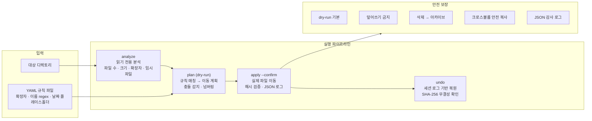

# File Organizer

> Safety-first 설계의 디렉토리 파일 자동 정리 CLI 도구 (dry-run 기본, undo 지원, YAML 규칙 엔진)


## Overview

지정된 디렉토리의 파일을 YAML 규칙에 따라 자동 분류/이동하는 CLI 도구이다. 안전성을 최우선으로 설계하여 dry-run이 기본 동작이며, 모든 작업은 JSON 로그로 기록되어 undo가 가능하다. 실행 전 항상 미리보기를 보여주고, `--confirm` 플래그 없이는 파일을 이동하지 않는다. 삭제 대신 아카이브, 충돌 시 자동 넘버링, 크로스볼륨 안전 복사 등 10가지 안전 보장을 제공한다.

## Tech Stack

| 영역 | 기술 |
|------|------|
| Language | Python 3.10+ |
| CLI | Typer + Rich (컬러 출력, 테이블, 프로그레스바) |
| 규칙 엔진 | YAML (PyYAML) |
| 삭제 대체 | send2trash (시스템 휴지통 연동) |
| 무결성 | SHA-256 해시 검증 |
| 테스트 | pytest + pyfakefs |
| 패키징 | pyproject.toml (PEP 621) |

## Architecture



## Key Features

- **Safety-first** -- `plan`은 dry-run, `apply`는 `--confirm` 필수, 실수로 파일을 잃을 수 없는 구조
- **YAML 규칙 엔진** -- 확장자/이름 regex 매칭, `{year}/{month}` 날짜 플레이스홀더, top-to-bottom 우선순위
- **완전한 Undo** -- 모든 세션을 JSON 로그로 기록, SHA-256 해시 검증 후 원위치 복원
- **충돌 안전** -- 이름 충돌 시 `(2)`, `(3)` 자동 넘버링, 덮어쓰기 절대 불가
- **크로스볼륨 복사** -- 다른 파일시스템 간 이동 시 복사 -> 해시 검증 -> 원본 삭제 (중간 실패 시 양쪽 보존)
- **쿨다운 보호** -- 최근 수정 파일(기본 30분) 자동 스킵, 작업 중인 파일 보호
- **시스템 폴더 제외** -- `.git`, `node_modules`, `__pycache__`, 클라우드 동기화 폴더 자동 제외

## Getting Started

```bash
pip install -e .
organizer analyze --scope ~/Downloads        # 읽기 전용 분석
organizer plan --scope ~/Downloads            # 이동 계획 미리보기 (dry-run)
organizer apply --scope ~/Downloads --confirm # 실제 실행
```

## Project Structure

```
file-organizer/
├── organizer/
│   ├── cli.py          # Typer CLI 엔트리포인트
│   ├── analyzer.py     # 읽기 전용 디렉토리 분석
│   ├── planner.py      # dry-run 이동 계획 생성
│   ├── executor.py     # 파일 이동 실행 (해시 검증)
│   ├── rules.py        # YAML 규칙 로딩 + 매칭
│   ├── safety.py       # 안전 검사 (쿨다운, 제외 목록)
│   ├── logger.py       # JSON 세션 로그
│   └── undo.py         # 세션 복원 (SHA-256 검증)
├── config/
│   └── default_rules.yaml  # 기본 분류 규칙
├── tests/              # pytest + pyfakefs
├── pyproject.toml      # PEP 621 패키징
└── cron-weekly.sh      # 주간 자동 실행 스크립트
```

## Technical Decisions

- **Dry-run 기본 동작**: 파일 정리 도구의 가장 큰 위험은 의도치 않은 파일 이동이다. `plan` 명령을 기본으로 하고, 실행에 명시적 `--confirm`을 요구하여 사고를 구조적으로 방지했다.
- **YAML 규칙 분리**: 분류 로직을 코드에서 분리하여, 프로그래밍 지식 없이 규칙을 추가/수정할 수 있게 했다. 규칙은 top-to-bottom 평가로 우선순위가 명확하다.
- **SHA-256 기반 Undo**: 단순 경로 기반 복원은 중간에 파일이 변경되면 데이터 손상이 발생한다. 이동 시점의 해시를 기록하고, 복원 전 무결성을 검증하여 안전한 undo를 보장했다.
